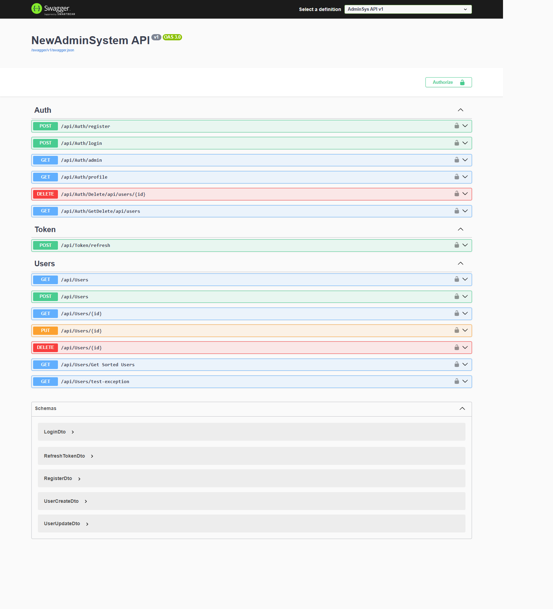
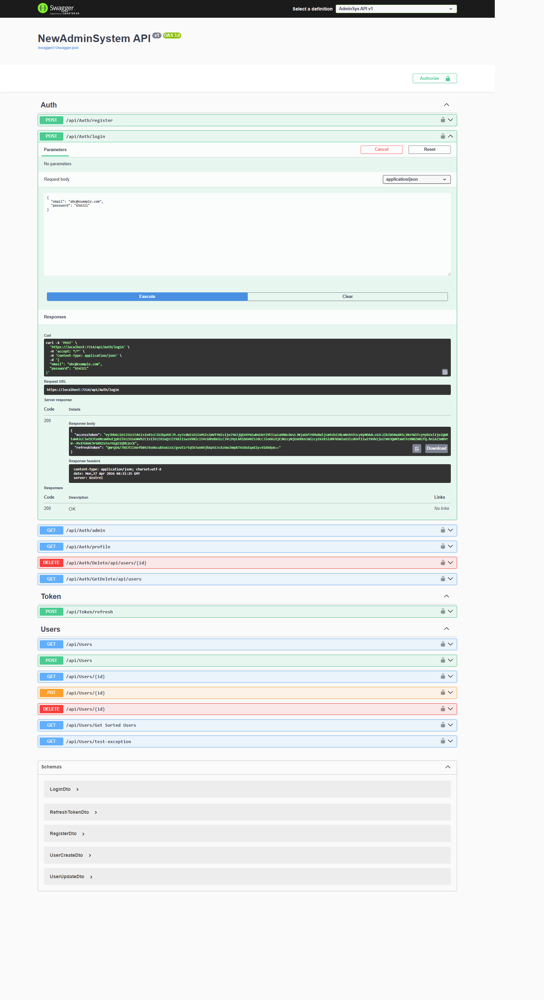
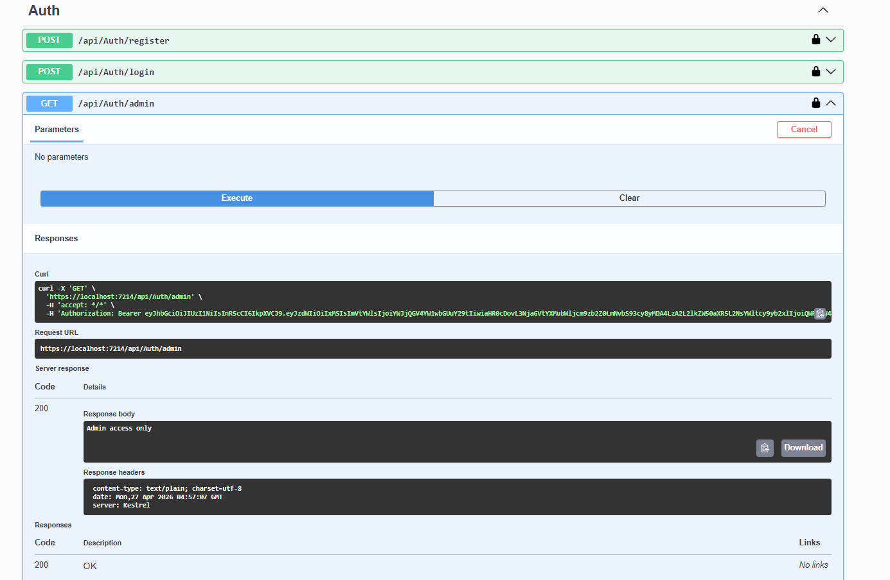
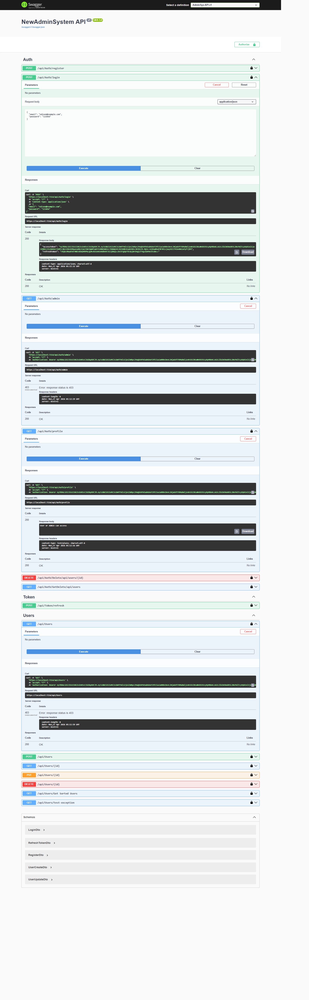
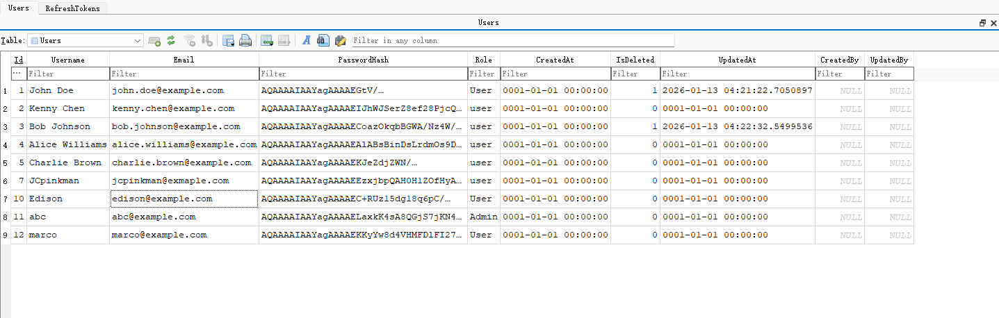
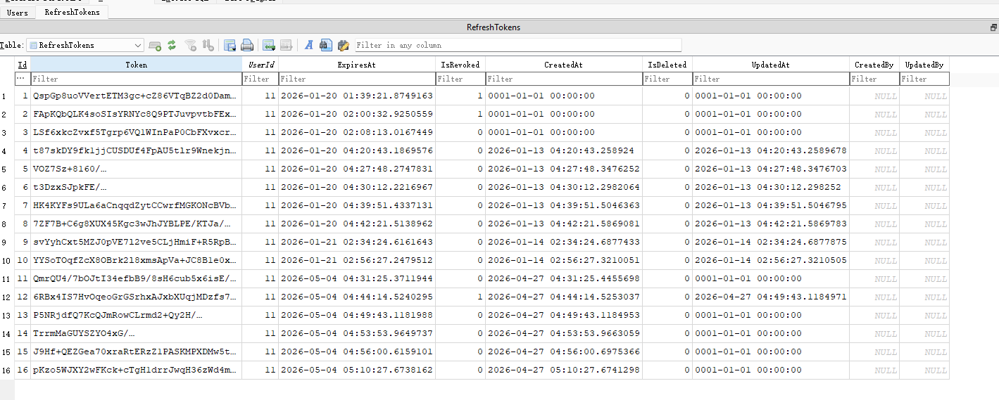

# AdminSys API

A .NET 8 Web API backend system with JWT authentication, role-based authorization, refresh token support, soft delete, audit logging, and Swagger documentation.

## Tech Stack
- ASP.NET Core 8 Web API
- Entity Framework Core (SQLite)
- JWT Authentication
- Role + Policy-based Authorization (RBAC)
- AutoMapper
- FluentValidation
- Swagger / OpenAPI
- BCrypt Password Hashing

## Project Architecture
AdminSys.Api  
│  
├── Controllers  
│   ├── AuthController  
│   ├── UsersController  
│   ├── TokenController  
│  
├── Data  
│   └── AppDbContext  
│  
├── Models  
│   ├── User  
│   ├── RefreshToken  
│   ├── BaseEntity  
│  
├── DTOs  
│   ├── Auth  
│   ├── Users  
│   └── Common (ApiResponse, PagedResult)  
│
├── Services  
│   ├── IUserService  
│   ├── UserService  
│   ├── ITokenService  
│   └── TokenService  
│
├── Authorization  
│   ├── Roles  
│   └── Permissions  
│
├── Middlewares  
│   └── ExceptionMiddleware  
│  
└── Mappings  
    └── AutoMapper Profiles  

## Screenshots
### API Overview (Swagger)  
  

### Authentication  

### Swagger Authorization - Admin  
  

### Authorization Example - User  
  

### Database Schema  
User Data  
  
Refesh Token Data  
  

## Features
### Authentication
- User Registration
- Login with JWT Token
- Refresh Token mechanism
- Password hashing (BCrypt)
### Authorization
- Role-based access control (Admin / User)
- Policy-based authorization (fine-grained permissions)
- JWT Claims-based security

### User Management
- CRUD operations
- Pagination, sorting, and search
- Soft delete support

### Audit System
- CreatedAt / UpdatedAt
- CreatedBy / UpdatedBy
- Automatic tracking via DbContext

### Soft Delete
- Logical deletion using IsDeleted
- Global query filter applied automatically

## Setup Instructions
### 1 Clone project
git clone https://github.com/your-repo/AdminSys.Api.git  
cd AdminSys.Api  

### 2 Install dependencies
dotnet restore  

### 3 Configure appsettings.json
{  
  "ConnectionStrings": {  
    "DefaultConnection": "Data Source=adminsys.db"  
  },  
  "Jwt": {  
    "Key": "YOUR_SUPER_SECRET_KEY",  
    "Issuer": "AdminSys",  
    "Audience": "AdminSysClient",  
    "ExpireMinutes": 60  
  }  
}  

### 4 Run migrations
dotnet ef database update  

### 5 Run project
dotnet run  

## Swagger

Once running:  

http://localhost:xxxx/swagger  

### Authorize in Swagger
Bearer YOUR_JWT_TOKEN  

### Authentication Flow
Register  
POST /api/auth/register  
Login  
POST /api/auth/login  

Response:  

{  
  "accessToken": "jwt...",  
  "refreshToken": "..."  
}  
Refresh Token  
POST /api/tokens/refresh  

### Authorization Examples
Admin only  
[Authorize(Roles = "Admin")]  
Policy-based  
[Authorize(Policy = "User.Read")]  
### User API Features
GET Users (Paged)  
GET /api/users?page=1&pageSize=10&keyword=admin  
Create User  
POST /api/users  
Update User  
PUT /api/users/{id}  
Soft Delete  
DELETE /api/users/{id}  
### Key Design Decisions
DTO separation from Entity models  
Service layer for business logic  
JWT-based stateless authentication  
Refresh token stored in database  
Global exception handling middleware  
Soft delete instead of physical delete  
Audit fields automatically managed by DbContext  
## Future Improvements
Redis Refresh Token storage  
Multi-device login control  
Logging system (Serilog)  
Docker deployment  
CI/CD pipeline  
Unit testing (xUnit + Moq)  
## Author

Built by Yu Chen  
Backend Developer (ASP.NET Core / Full Stack)  

## License

MIT License  